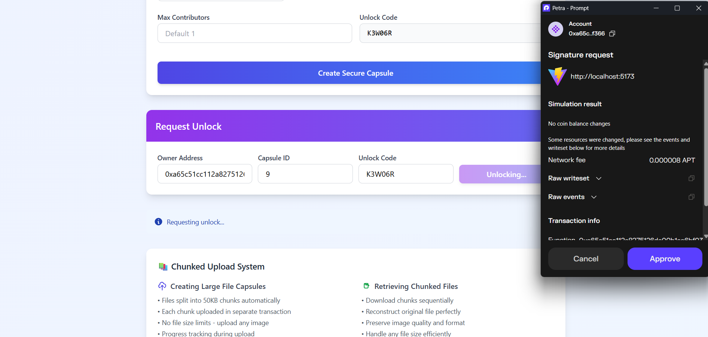

# MEMORA

### Team Name  -> **Vertex**

### Members

| Name                          | Email                     | LinkedIn                                           |
|-------------------------------|---------------------------|---------------------------------------------------|
| Peddibhotla Sree Satya Harsha | harsha.pss2005@gmail.com  | [LinkedIn](https://www.linkedin.com/in/harsha-pss/) |
| Pathivada Harsha Vardhan      | harshabambu@gmail.com     | [LinkedIn](https://www.linkedin.com/in/harshabambu/) |
| Parasa Kamal Siddardha        | siddhuparsa99@gmail.com  | [LinkedIn](https://www.linkedin.com/in/siddhu-parasa/) |

---

### Problem Statement
Current cloud services lack tamper-proof, location-restricted, and user-owned data management features. A secure, decentralized platform is needed to store and share sensitive data with **time-lock**, **geo-lock**, and **blockchain-based access control**.

---

### Project Description
Current cloud services don’t give users full control or guarantee security for sensitive data. A decentralized platform can fix this by letting users store encrypted files with:

- **Time-locks**
- **Geo-locks**
- **Blockchain-based access control**

Users can create personal or collaborative **“time capsules”** that:

- Unlock in the future
- Share files securely with selected people
- Restrict access to specific locations

All files remain encrypted, and smart contracts enforce access rules. This makes the system **tamper-proof, private, and suitable for personal, corporate, or sensitive operations**.

---

## Smart Contracts

### 1. Blockchain Time Capsule
**Purpose:** Store encrypted content metadata with a release date.

**Key Variables:**

- `capsule_id` – Unique identifier for each capsule  
- `unlock_timestamp` – Block time when capsule can be opened  
- `owner` – Creator’s wallet address  
- `ipfs_hash` – Link to encrypted content in decentralized storage  
- `encrypted_key` – Stored encrypted; revealed only after unlock time  

**Functions:**

- `create_capsule(...)` – Creates a new capsule with metadata  
- `unlock_capsule(capsule_id)` – Releases key if `block_time >= unlock_timestamp`  
- `view_capsule(capsule_id)` – Fetch metadata (no decryption)  

---

### 2. Geo-Locked Capsule
**Purpose:** Allow access only within a specific geographical area.

**Key Variables:**

- `longitude` – Target longitude coordinate  
- `latitude` – Target latitude coordinate  
- `radius` – Allowed range from target coordinates  
- `unlock_timestamp` – Optional; can combine with a time lock  
- `ipfs_hash` – Link to encrypted data in decentralized storage  

**Functions:**

- `create_geo_capsule(longitude, latitude, radius, ipfs_hash, unlock_timestamp?)` – Create capsule restricted to a coordinate range  
- `verify_location(capsule_id, user_longitude, user_latitude)` – Check if user is within allowed radius  
- `(Future)` `verify_location_hash(capsule_id, location_proof)` – Use hashed GPS coordinates with an oracle for secure validation  

---

## Screenshots

### After Connecting Petra & Uploading an Image

### Unlocked Case

### Locked Case

